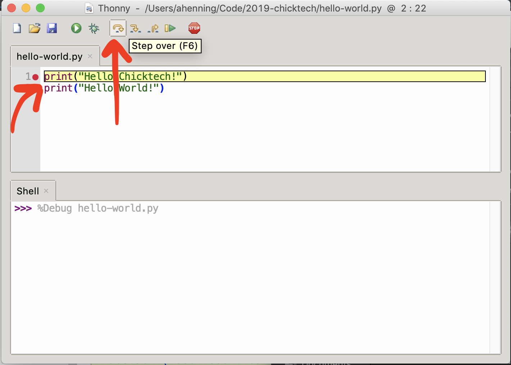

# Getting started with programming

Programming can be thought of as giving instructions, called **code**, to a computer to carry out on
its own. The words and grammar of those instructions is defined by the **programming language** you 
write them in, just like different languages we may use to communicate between people.

For example, using the Python programming language, we can instruct the computer to display "Hello 
Chicktech!" to our screen with the following code.

```python
print("Hello Chicktech!")
``` 

This is an instruction that tells the computer to "print" the text "Hello Chicktech!" to the 
screen. Python is a simple but powerful programming language that is famously easy to learn but 
still powerful enough to --insert some cool statistic about how widely python is used--.

Let's try it out!

## Development environments

Writing programs, like playing music or building a house, requires tools. A common tool is an 
"integrated development environment" or IDE for short. We'll use the **Thonny** IDE today.

> Insert pictures of directions to open Thonny here

In Thonny, type `print("Hello Chicktech!")` into the top window pane.


Now click the green run button above.


Congrats! You've got a working program!

## Debugging

Instructions in Python programs (sometimes also called "scripts") are run line-by-line, one at a 
time. Let's add another and see. Edit your code to look like the following by adding an additional
line.

```python
print("Hello Chicktech!")
print("Hello World!")
``` 

Now if we run this, we should see both "Hello Chicktech!" and "Hello World!" displayed in that 
order.

One neat feature of IDEs is that they have **debuggers**. These are tools which allow us to watch a
program run, pause it mid-execution, and inspect it as it does. We can trigger pauses by adding
**breakpoint** on the lines that we want to pause. Add breakpoints by double clicking on the first
line's line number on the left ("1"). Then click the green debug button above.  


When you click debug, notice you do not immediate see "Hello Chicktech!". Instead, execution is
paused at the first line (where you added a breakpoint), which is also highlighted in yellow. To 
execute this first line, press the "step over" button above, which "steps over" and executes 
the current line.



Now you see "Hello Chicktech!" output on the bottom pane. Press it again to see "Hello World!".

## Functions and variables

In our program, `print` is a function. Functions group many instructions together so than can
be reused simply by referencing the function's name. When we reuse a function, we say we're 
**calling** that function. 

We can write our own functions, too. Try this program for example:

```python
def greet(who):
    print("Hello {}!".format(who))

greet("Chicktech")    
greet("World")
```

If you run this program, you'll see it prints the same as our previous version. Let's break this
down a little bit.

Defining a function works like this:

1. First write the `def` **keyword**. This tells python we're about to define a function.
2. Then write the function's name next to `def` separated by a space.
3. Then we have a **parameter list**, surrounded by parenthesis. Parameters allow us to reuse a 
function with different values. In our `greet` function, the `who` parameter allowed us to print 
several greetings with the same function.

Let's write another function that adds two numbers.

```python
def add(x, y):
    return x + y

print(add(2, 2))
```

```python
def add(x, y):
    return x + y

firstNumber = add(2, 2)
anotherNumber = add(5, 10)
print(add(firstNumber, anotherNumber))
```

