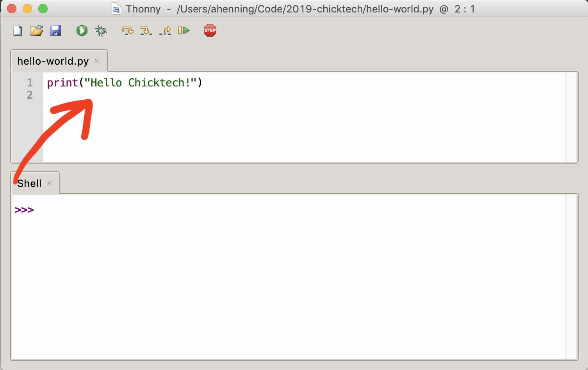
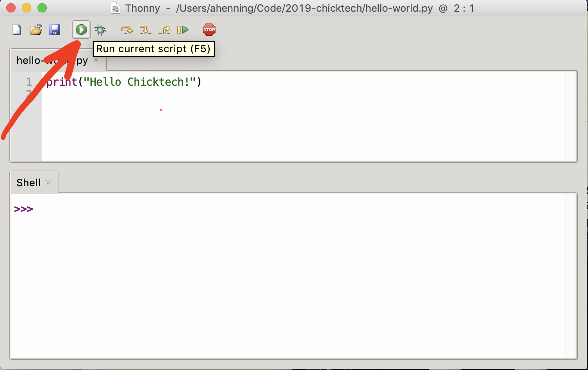
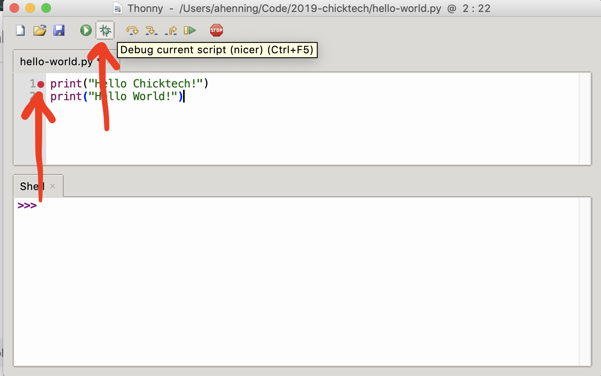
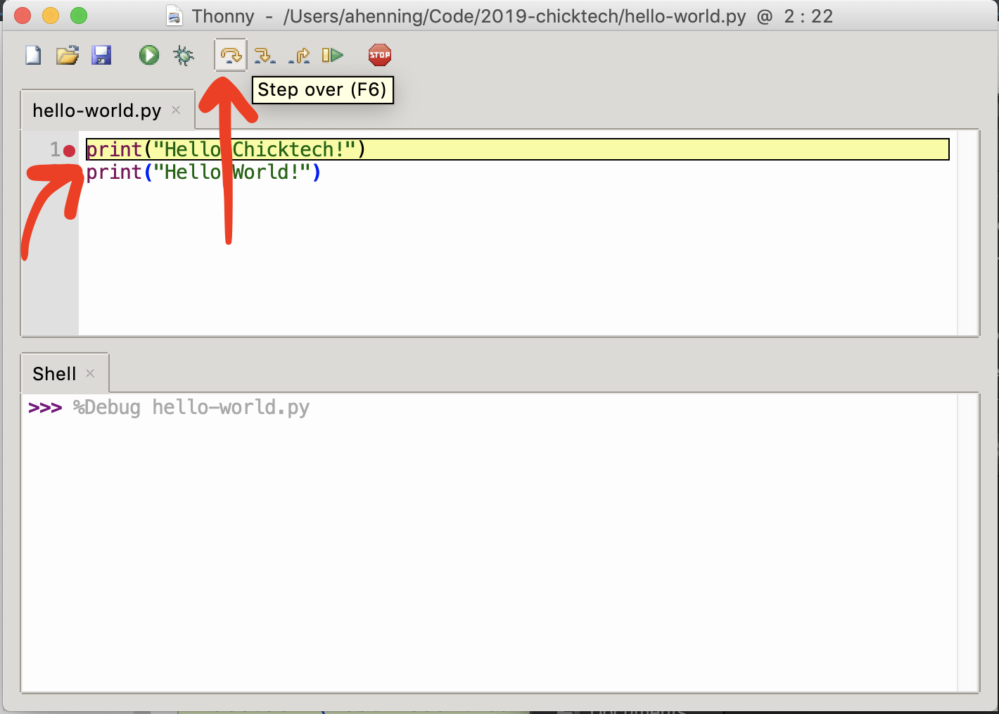
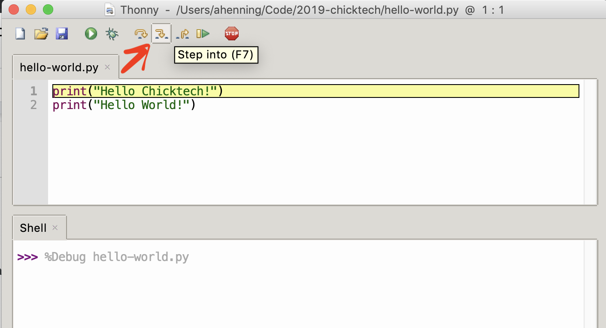
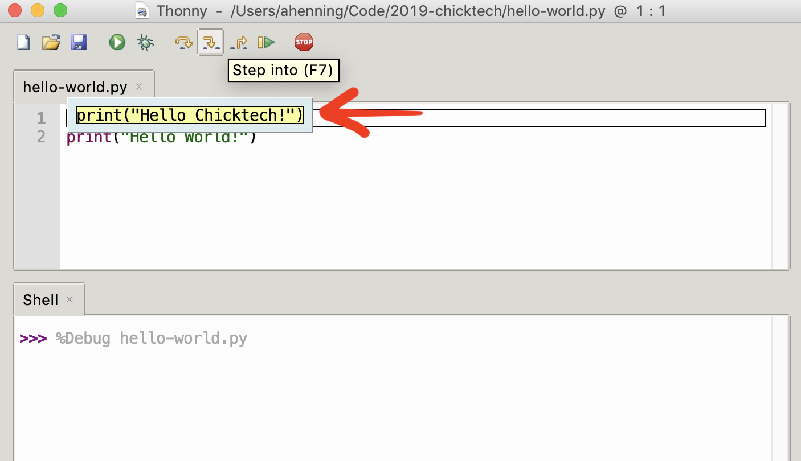
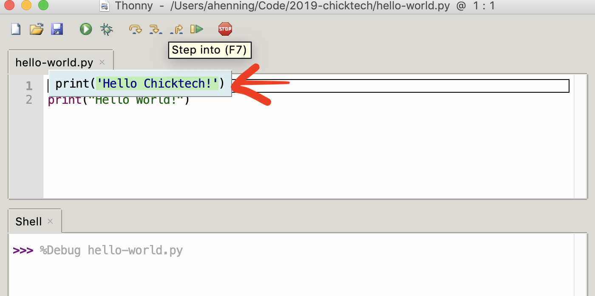
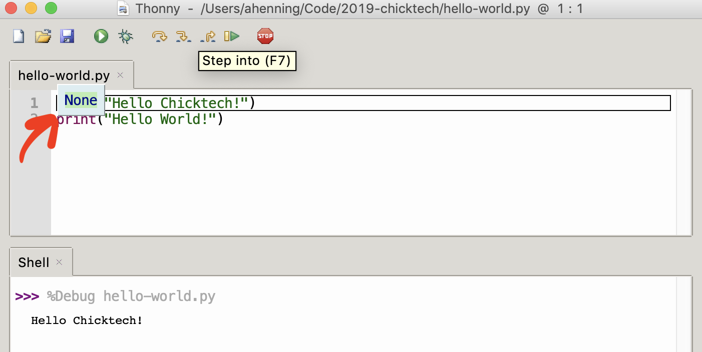
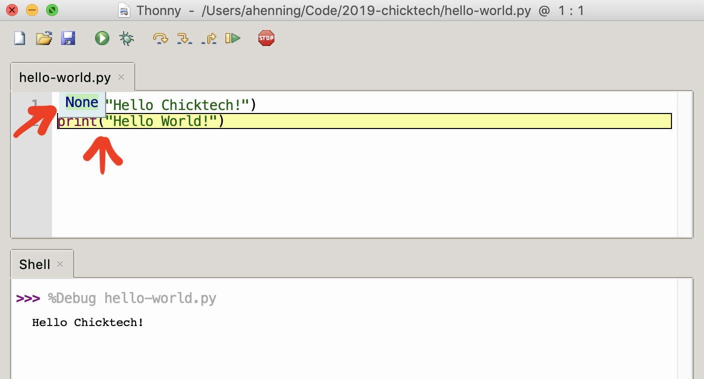

# Python workshop

## 1. Getting started with programming

Programming can be thought of as giving instructions, called **code**, to a computer to carry out on
its own. The words and grammar of those instructions is defined by the **programming language** you 
write them in, just like different languages we may use to communicate between people.

For example, using the Python programming language, we can instruct the computer to display "Hello 
Chicktech!" to our screen with the following code.

```python
print("Hello Chicktech!")
```

This is an instruction that tells the computer to "print" the text "Hello Chicktech!" to the 
screen. Python is a simple but powerful programming language that is famously easy to learn but 
still powerful enough to --TODO: insert some cool statistic about how widely python is used--.

Let's try it out!

### 1.1 Development environments

Writing programs, like playing music or building a house, requires tools. A common tool is an 
"integrated development environment" or IDE for short. We'll use the **Thonny** IDE today.

> TODO: Insert pictures of directions to open Thonny here

In Thonny, type `print("Hello Chicktech!")` into the top window pane.



Now click the green run button above.



Congrats! You've got a working program!

### 1.2 Debugging and expressions

Instructions in Python programs (sometimes also called "scripts") are run line-by-line, one at a 
time. Let's add another and see. Edit your code to look like the following by adding an additional
line.

```python
print("Hello Chicktech!")
print("Hello World!") # Programming is great!
``` 

Now if we run this, we should see both "Hello Chicktech!" and "Hello World!" displayed in that 
order.

Our second line also included a **comment**, which started with the `#`. Comments can contain any 
text you want, and are ignored by the computer. They're just for people to communicate and 
understand their code better.

One neat feature of IDEs is that they have **debuggers**. These are tools which allow us to watch a
program run, pause it mid-execution, and inspect it as it does. We can trigger pauses by adding
**breakpoint** on the lines that we want to pause. Add breakpoints by double clicking on the first
line's line number on the left ("1"). Then click the green debug button above.  



When you click debug, notice you do not immediate see "Hello Chicktech!". Instead, execution is
paused at the first line (where you added a breakpoint), which is also highlighted in yellow. To 
execute this first line, press the "step over" button above, which "steps over" and executes 
the current line.



Now you see "Hello Chicktech!" output on the bottom pane. Press it again to see "Hello World!".

To remove a breakpoint, double click the breakpoint icon (the red circle next to the line number)
again. Try that now. If we start debugging now, our IDE will start stepping immediately from the 
first line, as if we set a breakpoint there. Click debug now, but don't step forward yet.

This time, let's use the "step into" button, instead of "step over". "Step into" allows us to see 
more deeply into what our program is doing, which is useful when we start to define more complex 
programs. "Step over" is useful when we want an overview, and don't want to get bogged down with 
the details.

1. Click "Step into" **once**.
   
2. Notice that our IDE has popped out the current line and highlighted it, executing it and moving 
   to the next line.
   
3. Click "Step into" **two** more times.
4. Now notice the text `"Hello Chicktech!"` changed color. The IDE **evaluated** our **expression**
   and is showing the result. Our expression, `"Hello Chicktech!"` was very simple, so it evaluated 
   to the same thing, but all kinds of expressions exist in python as a way to compute more 
   interesting values.
   
5. Click "Step into" **two** more times. 
6. Now notice `print` has turned into a green `None`. The `print` instruction itself is an 
   expression, but it doesn't evaluate to anything. `None` is python's value that represents nothing.
   
7. Click "Step into" **one** more time. 
8. Notice the expression from the previous line remains, even though our debugger is now paused 
   before the next line. This helps us keep track of previous expressions. 
   

### 1.3 Functions and variables

In our program, `print` is a function. Functions group many instructions together so than can
be reused simply by referencing the function's name. When we reuse a function, we say we're 
**calling** that function. 

We can write our own functions, too. Try this program for example:

```python
# Program 1.3.1
def greet(who):
    print("😎 Hello {}! 😎".format(who))

greet("Chicktech")    
greet("World")
```

If you run this program, you'll see it prints the same as our previous version, but now we can 
change how say hello in one place and have all greetings be uniform. Let's break this down a little 
bit.

Defining a function works like this:

1. First write the `def` **keyword**. This tells python we're about to define a function.
2. Then write the function's name next to `def` separated by a space. Names are the words of our
program. Just like words in languages, we use them to communicate and express ideas and work we 
need to do, but for the computer to understand in addition to other people. We'll use the function 
name to refer to it later.
3. Then we have a **parameter list**, surrounded by parenthesis. Parameters allow us to reuse a 
function with different values. In our `greet` function, the `who` parameter allowed us to print 
several different greetings reusing the same function. We can refer to that parameter's value by its
name.

Let's write another function that adds two numbers.

```python
# Program 1.3.2
def add(x, y):
    return x + y

print(add(2, 2))
```

Parameters are very similar to **variables**. You're probably already familiar with variables from
algebra. Variables remember a value for later reuse. For example, the below program adds numbers,
remembers those results, and then adds those results.

```python
# Program 1.3.3
def add(x, y):
    return x + y

first_number = add(2, 2)
another_number = add(5, 10)
print(add(first_number, another_number))
```

## 2. Writes scripts to interact with your blog

### 2.1 The amazing world of open source

So far we've written some small, simple programs. Writing something like a multiplayer game or a 
blog website at this rate would take a really long time! Fortunately, the cool thing about code is
that it can be easily shared and reused. By collaborating with others, we can build incredibly 
powerful programs in a fraction of the time it would take any one person alone to do it from 
scratch. Amazingly, there is a global community of sharing "open source" code: code that is freely 
available to be used, and free for you to modify and share your contributions back. This code is
bundled up into **packages** that can be downloaded and imported into your programs.

Let's use one of those packages, called "requests", that allows us to communicate with other 
websites, like the blog you're running, in our code. In this way, we can write programs that 
interact with our blog: automating tasks, summarizing posts, even displaying posts screens hooked up
to our Raspberry Pis. The sky is the limit!

> For full documentation of the "requests" package, see: https://2.python-requests.org/en/master/

```python
# Program 2.1.1
# Load the package named "requests"
import requests

# Named things like packages and variables can have functions and other variables within them that
# we can reuse. We can refer to them use the package name and a . character like so:
response = requests.get("http://blog.example.com/wp-json/wp/v2/posts", params={"per_page": 1})

# We've just made requested the latest blog post from our blog server. We've stored the response to 
# that request in a variable named "response" above.

# Requests and responses are like letters we can send or get in the mail. They have an envelope, 
# mailing and return addresses, and contents inside. 
# To get to the content inside our response–the blog post–, we use the "json()" function to 
# structure that content in a usable way. 
posts = response.json()

# We've stored the content in a variable called "posts" so we can refer to it more easily.
# "posts" is a **list**. Lists are ordered sequences of values.
# How do we know it's a list? We'll come back to this. 

# Check if the list is empty by using the "len" (for "length") function, which returns how many 
# elements are in a list. This makes sure we don't try to examine a post if there isn't one to 
# examine!
if len(posts) == 0:
    print("No blog posts found. You should post something on your blog first!")
else:
    # We can refer to the elements of a list by the index of that element using the [0] syntax,
    # where 0 is the first element in the list. Computers usually start counting from 0.
    post = posts[0]
    
    # We've stored the first post from our response in a variable named "post". This variable is
    # a **dictionary**. This means it has any number of values within it we can refer to by name,
    # similar to looking up definitions in a dictionary by the word.
    
    # Wordpress posts have a complicated structure with lots of values within them, and even nested
    # values within those. Below we'll navigate that structure to pull out the date of our post and
    # it's title using the ["word"] syntax – this refers to a value by it's name inside the 
    # quotations. In turn, that value can be anything, maybe even another dictionary.
    # How do we know which value is what? Similar to how we knew "posts" was a list. We'll come back
    # to this shortly.
    date_posted = post["date"]
    title = post["title"]["rendered"]
    
    # Print out the date and title. The "format" function here replaces symbols inside text with 
    # values from the variables we just defined above.
    print("{0}: {1}".format(date_posted, title))
```

Copy the above program into your IDE and run it. If you've written any posts in your blog, you 
should see the latest post and it's title. In a few lines of code (ignoring comments), we've 
constructed a request from our program, sent it to the blog server, and parsed its response. Cool!

Try debugging your program to watch and inspect the instructions and variables.

--TODO: Take screenshots of debugging. Consider moving commentary to be alongside debugging 
screenshots--

### 2.2 The World Wide Web and APIs

In the above example, we not only pulled code from another package, but we also used code from an
entirely separate program: your blog server. We asked the "requests" package to make a request to 
your blog for us, and we asked the blog server for the latest blog post title. We didn't have to 
write any of the code to store, manage, or retrieve that information. And similarly, those packages
then use other packages, too, and so on. That blog post script you have written above easily spans 
millions of lines of code if you think about all of the layers of packages that get used, all the 
way down to your operating system and your computers device drivers.

We can do this because of something called **application programming interfaces**, or **APIs** for 
short. APIs define a kind of simple language, specific to a certain area–like math, or blogs, or 
weather, or tweets–that can hide a limitless amount of code underneath it. When we use packages or
other servers, all we need are their APIs. Then, the rest of the implementation is hidden us, and 
can change and improve without us. We don't need to know or learn all of that code. APIs make us 
incredibly productive and allow us to create amazing things relatively quickly.

--TODO: insert diagram about APIs--

Different APIs come in different flavors. When talking to a website server, like the Wordpress blog 
from our python script, we interact using the HTTP protocol. A protocol is just an agreed way for
different parties to communicate or accomplish some task together. Think of snail mail: when you 
send a letter, we have a protocol that says we use envelopes, we write our addresses a certain way,
we put it in a mailbox, and letters get sent back to us in a similar way. The HTTP protocol is what 
serves websites over the internet.

--TODO: insert diagram about web service communication--

> For full documentation of the Wordpress API, see: https://developer.wordpress.org/rest-api/

The Wordpress API can do just about anything we want with our blog. Let's explore!

```python
# Program 2.2.1
import requests

# In this program, we're going to make requests to the Wordpress API multiple times. We can start to
# see some patterns in how we make calls to the API. Also, we want our program to easily read in
# instructions we understand. Instead of saying "make a request to this URL with these 
# parameters and parse it as JSON" multiple times, which is too detailed to repeat so often, we'd
# like to say more clearly what we're trying to do: "list the latest blog posts". Just like if you
# ask for a ride to school, you don't say "please let me sit in your car, put the car into gear,
# press the gas until the end of the driveway, then turn left, then stop at the stop sign, ..." and
# so on. That is painstakingly detailed, and it would be really hard for the person you're asking to
# understand what you were really asking for. Instead we simply say "may I have a ride to school?"
# Once we do something once, we can refer to it more quickly. The same is true with programs.
# Programs need to be clearly understood by humans, too, not just computers.

# To accomplish this, we're going to create a **class** to help organize our code. A class is a
# collection of functions and variables that we can reuse.

# Start defining a class similar to how you define a function, but instead of the "def" keyword,
# use the "class" keyword, followed by the class's name. Just like with a function, defining the 
# class alone doesn't use it. It creates a template that we can reuse later.
class Blog:
    # Now we can define functions inside the class.
    # Classes start with a special "__init__" function which is used to create a new instance of the
    # class based on zero or more parameters. Here we have a "url" variable that remembers the URL 
    # of your blog for reuse in other functions.
    def __init__(self, url):
        self.url = url

    def list_latest_posts(self, at_most):
        response = requests.get(self.url + "/posts", params={"per_page": at_most})
        return response.json()

    def list_comments_on_post(self, post_id, at_most):
        response = requests.get(self.url + "/comments", params={"post": post_id, "per_page": at_most})
        return response.json()

blog_api_url="http://blog.example.com/wp-json/wp/v2"

blog = Blog(blog_api_url)
latest_posts = blog.list_latest_posts(at_most=1)

if len(latest_posts) > 0: 
    latest_post = latest_posts[0]
    comments = blog.list_comments_on_post(post_id=latest_post['id'], at_most=10)
    print("Your latest post has {0} comments! 😀".format(len(comments)))
else:
    print("No blog posts found. You should post something on your blog first!")
```


